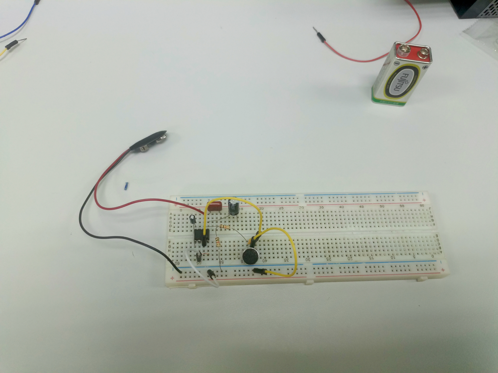

# 🔊 Audio Amplifier Circuit using LM386

This project demonstrates the design and construction of an **audio power amplifier circuit** using the **LM386 IC**.  
The circuit amplifies a small microphone input signal to drive a speaker, producing clear sound output.  

It serves as a fundamental project for understanding **analog amplification**, **gain control**, and **audio signal processing**.

---

## 🖼️ Project Image

  

---

## 📄 Project Report
📘 [View Report (PDF)](Audio_Amplifier_Circuit_Report.pdf)

---

## ⚙️ Circuit Description

The **LM386** is a low-voltage audio power amplifier that can deliver up to **1W of power output**.  
In this circuit, the **microphone** captures sound signals, which are then amplified and output through a **speaker**.

The amplification level can be controlled using a **potentiometer**, and capacitors are used for **signal coupling** and **noise filtering**.

🧩 **Basic Operation Flow:**

---

## 🔧 Components Used

| Component | Quantity | Description |
|------------|-----------|-------------|
| LM386 | 1 | Audio amplifier IC |
| Microphone | 1 | Captures input sound |
| Speaker | 1 | Outputs amplified audio |
| Potentiometer | 1 | Adjusts volume / gain |
| Capacitors (Ceramic + Electrolytic) | Several | Coupling and filtering |
| Resistors | Several | Biasing and stability |
| 9V Battery | 1 | Power supply |

---

## 🧰 Tools & Equipment
- Breadboard / PCB  
- Jumper wires  
- Soldering kit (for permanent assembly)  
- Multimeter (for signal measurement)  
- Oscilloscope *(optional for waveform analysis)*

---

## 🧠 Key Concepts
- **Analog signal amplification** using LM386  
- **Gain control** via external components  
- **Audio filtering** using capacitors  
- Understanding **noise reduction** and **signal coupling**

---

## 🎓 Learning Outcomes
- Learn how to **design and test analog circuits**  
- Understand the **principles of power amplification**  
- Analyze **input-output audio response**  
- Gain experience in **hardware circuit assembly and troubleshooting**

---

### 👤 Author
**Mohd Azrul Redzuan**  
🎓 Industrial Automation Technology – UTeM  
🔗 [GitHub Profile](https://github.com/muhdazrulredzuan)
