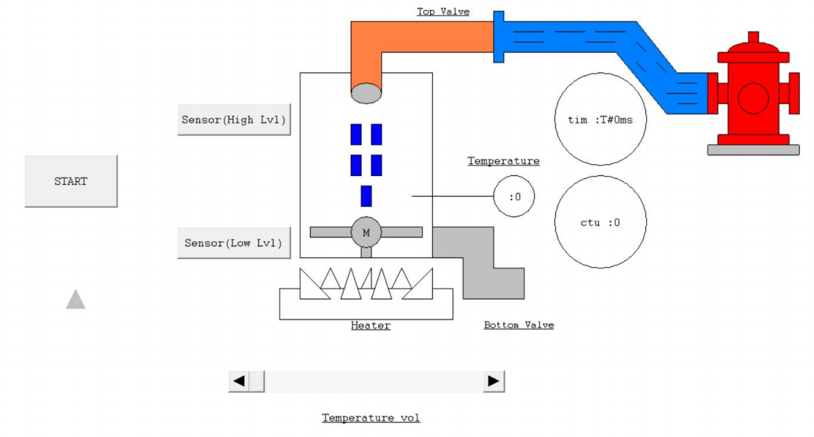

# 💧 Automatic Water Tank Control System

This project simulates an **automated water tank system** built using **CoDeSys (Ladder Diagram)**.  
The system automatically controls **water filling, heating, mixing, and draining** in a continuous cycle, based on sensor feedback and process conditions.

---

## 🖼️ Project Image

  

---

## 📄 Project Report
📘 [View Report (PDF)](Automatic_Water_Tank_Simulation.pdf)

---

## ⚙️ System Description

The process begins when the **Start Push Button (PB Start)** is pressed, triggering a fully automated sequence:

1️⃣ **Filling Stage**  
   - Valve 2 opens to fill the tank with water.  
   - When the **Full Sensor (S2)** detects full capacity, Valve 2 closes.

2️⃣ **Heating Stage**  
   - The **Heater** turns ON to heat the water.  
   - When the temperature reaches **90°C**, the heater automatically turns OFF.

3️⃣ **Mixing Stage**  
   - The **Motor** turns ON for 5 seconds to stir the water in the tank.  
   - After 5 seconds, the motor stops.

4️⃣ **Draining Stage**  
   - **Valve 1** opens to drain the tank.  
   - When the **Empty Sensor (S1)** detects no water, Valve 1 closes.

5️⃣ **Repeat Cycle**  
   - The process repeats **three times**, then stops automatically.  
   - To restart, the **PB Start** button must be pressed again.

---

## 🧠 Ladder Diagram Overview

The control logic was developed using **Ladder Diagram (LD)** programming in **CoDeSys**.  
It includes timer blocks, counters, and interlock conditions to ensure process safety and proper sequencing.

---

## 🔧 Components and Variables

| Component / Variable | Function |
|-----------------------|-----------|
| `PB_START` | Start button for initiating the process |
| `S1` | Empty tank sensor |
| `S2` | Full tank sensor |
| `VALVE_1` | Controls water outflow |
| `VALVE_2` | Controls water inflow |
| `HEATER` | Heats water to 90°C |
| `MOTOR` | Mixes water inside the tank |
| `COUNTER` | Counts total process cycles |

---

## 🧰 Tools & Software
- 💻 **CoDeSys** (Ladder Diagram Programming)  
- ⚡ **PLC Simulation Environment**  
- 🧪 **Virtual Sensors (S1, S2, Temp)**  
- 🧩 **Timers, Counters & Logic Gates**

---

## 🎯 Learning Outcomes
- Understand **PLC sequencing and process automation**  
- Learn to use **Ladder Diagram (LD)** in CoDeSys  
- Implement **timers, counters, and conditional logic**  
- Design and test **repetitive control systems**

---

## 📚 Project Summary
This project demonstrates a **realistic automation process** found in industrial systems such as chemical processing or water treatment plants.  
It highlights the integration of **control logic**, **sensor feedback**, and **sequential operation** using a PLC simulation.

---

### 👤 Author
**Mohd Azrul Redzuan**  
🎓 Industrial Automation Technology – UTeM  
🔗 [GitHub Profile](https://github.com/muhdazrulredzuan)
