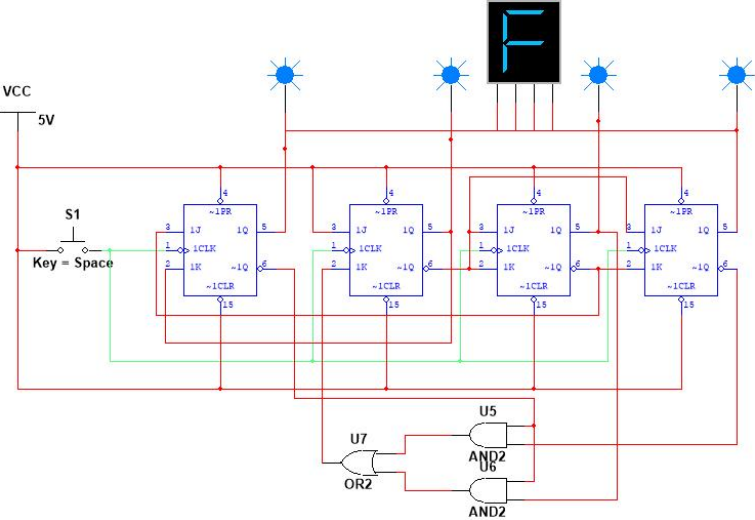

# 🔢 Synchronous Abnormal Counter

This project involves the design and simulation of a **Synchronous Abnormal Counter** using **JK Flip-Flops**.  
The circuit was developed and tested in **NI Multisim**, demonstrating knowledge of sequential logic, binary counting, and clock synchronization.

---

## 🖼️ Project Image

  

*(📸 Replace the image above with your actual Multisim circuit screenshot once uploaded.)*

---

## 📄 Project Report
📘 [View Report (PDF)](Synchronous_Abnormal_Counter_Report.pdf)

---

## 💾 Project File
[⬇️ **Download Project (.ms14)**](Synchronous_Abnormal_Counter.ms14)

---

## ⚙️ Project Description

The **Synchronous Abnormal Counter** is a digital circuit that counts through a **non-standard binary sequence** (abnormal sequence).  
Unlike normal binary counters, the output transitions are manually designed to skip or jump specific states.

🧠 The design uses:
- **JK Flip-Flops** as the core counting elements  
- **Clock pulses** to trigger state transitions  
- **Logic gates** for sequence control and next-state determination  
- **Switches** for manual input testing  

---

## 🔁 Sequence Example

| Clock Pulse | Q2 | Q1 | Q0 | Binary | Description |
|--------------|----|----|----|---------|-------------|
| 1 | 0 | 0 | 0 | 000 | Initial state |
| 2 | 0 | 1 | 0 | 010 | Skip normal binary order |
| 3 | 1 | 0 | 1 | 101 | Abnormal jump |
| 4 | 1 | 1 | 0 | 110 | Custom transition |
| 5 | 0 | 0 | 0 | 000 | Reset to initial |

*(🧩 Example sequence may vary based on logic design.)*

---

## 🧩 Logic Design

The counter was implemented using **JK Flip-Flop excitation equations** and a **truth table** for next-state logic.  
All flip-flops share a **common clock** (synchronous operation), ensuring all bits toggle simultaneously.

---

## 🧰 Tools & Components

| Tool / Component | Purpose |
|------------------|----------|
| **NI Multisim** | Circuit simulation |
| **JK Flip-Flop (IC 7476)** | Sequential logic element |
| **Switches** | Manual input control |
| **Clock Signal** | Provides timing pulses |
| **LED Indicators** | Display binary output |
| **VCC / GND** | Power supply for circuit |

---

## 📦 Files Included

| File Name | Description |
|------------|-------------|
| `Synchronous_Abnormal_Counter.ms14` | 💾 Multisim simulation project file |
| `synchronous_counter_project.jpg` | 🖼️ Circuit screenshot from Multisim |
| `report.pdf` | 📘 Full project report documentation |
| `README.md` | 🧾 Project information and description file |

---

## 🎯 Learning Outcomes

- Understand **synchronous counter design** and **flip-flop triggering**  
- Apply **excitation table** for JK flip-flops  
- Create **abnormal sequence logic** using combinational circuits  
- Test and verify **state transitions** in simulation software  

---

### 👤 Author
**Mohd Azrul Redzuan**  
🎓 Industrial Automation Technology – UTeM  
🔗 [GitHub Profile](https://github.com/muhdazrulredzuan)
