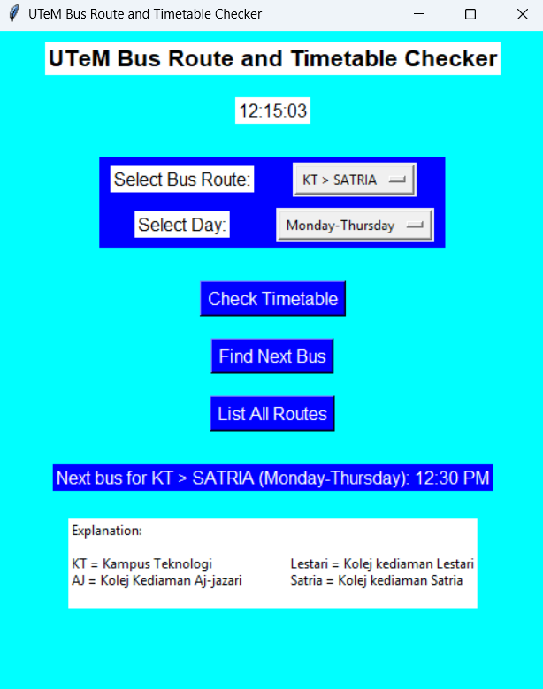

# 🚌 Real-Time Campus Bus Monitoring System (Python)

This project focuses on developing a **real-time bus tracking and monitoring system** for **UTeM campus transportation** using **Python**.  
The system displays live information such as **bus schedules, current locations, and next arrivals**, improving convenience for students and staff.

---

## 🖼️ System Interface
<p align="center">
  
</p>


---

## 📄 Project Report
📘 [View Report (PDF)](UTeM_Bus_Monitoring_System_Report.pdf)

---

## 💾 Source Code
[⬇️ **Download Source Code (.zip)**](UTeM_Bus_Monitoring_System.py)

---

## ⚙️ Project Description

The **Real-Time Campus Bus Monitoring System** is a Python-based application that uses a combination of **data handling, logic flow, and GUI visualization** to provide live bus tracking and schedule updates.

It simulates a smart public transport system on campus by showing:
- 🚍 **Current bus position**
- 🕐 **Next bus arrival time**
- 🗺️ **Bus route information**
- 🧭 **Estimated arrival countdown**

---

## 🧠 System Workflow

1. **Data Initialization**  
   Bus routes and schedules are loaded from predefined datasets or CSV files.

2. **Tracking Module**  
   Simulated or real-time location data (via GPS or manual updates) is processed.

3. **Display Interface**  
   Data is shown in a user-friendly terminal or GUI (e.g., Tkinter window).

4. **Update Loop**  
   System refreshes every few seconds to reflect new positions and estimated arrival times.

---

## 💻 Example Code Snippet

```python
import time

bus_schedule = {
    "Bus A": {"route": "Library → FKE → FTK", "next_departure": "08:30 AM"},
    "Bus B": {"route": "Kolej → Library → FKP", "next_departure": "08:45 AM"}
}

while True:
    print("📅 UTeM Campus Bus Schedule (Live Update)")
    for bus, info in bus_schedule.items():
        print(f"{bus} | Route: {info['route']} | Next: {info['next_departure']}")
    time.sleep(30)  # refresh every 30 seconds
