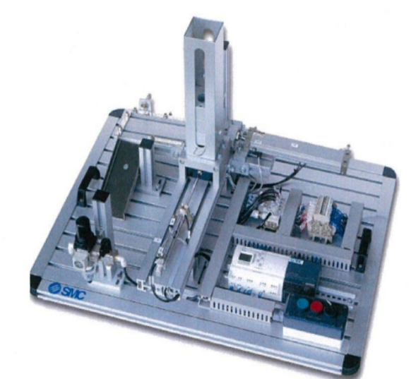
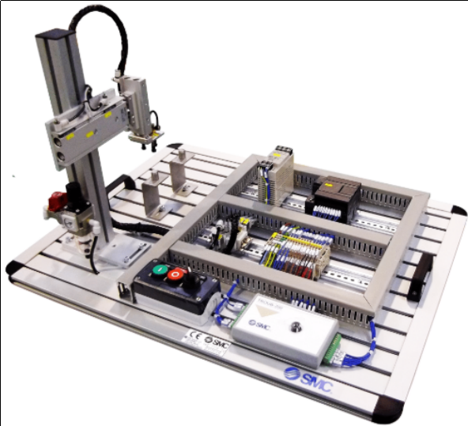
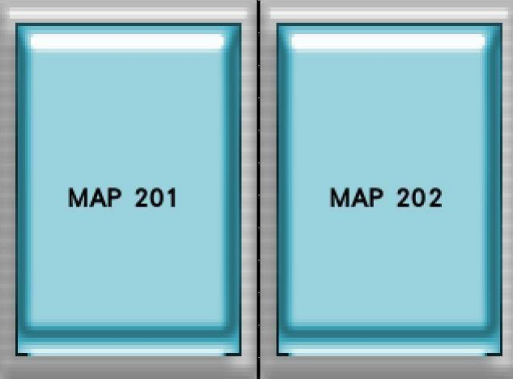
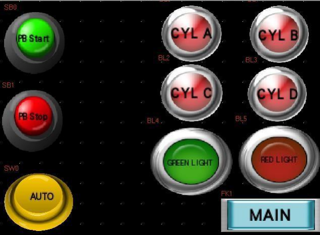
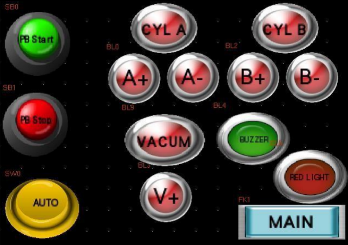

# 🖥️ MAP 201 & 202 (HMI Project)

This project integrates **PLC programming** and **Human Machine Interface (HMI)** to create a simple **industrial automation control system**.  
It demonstrates real-time monitoring and process control using **CX-Programmer** and an **HMI panel**, representing communication between a controller and operator interface.

---

## 🖼️ Project Overview
This project consists of two main parts:
1. PLC logic programming using **Ladder Diagram** for automation sequences.  
2. HMI interface design for visual feedback and manual control.  

<table align="center">
  <tr>
    <td align="center">
      <b>MAP 201</b> 
      
    </td>
    <td align="center">
      <b>MAP 202</b> 
      
    </td>
  </tr>
</table>

The system simulates a **Pick and place**, **Sorting**, and **Cylinder operation** that can be monitored and controlled via HMI.

---

## ⚙️ Key Features
- 🧩 PLC logic designed using **CX-Programmer**  
- 🖥️ Interactive **HMI interface** for user control  
- 🔁 Real-time status display of sensors and actuators  
- ⚡ Demonstrates **two-way communication** between PLC and HMI  

---

## 🖼️ View HMI
Here are additional screenshots from the HMI interface:

<table align="center">
  <tr>
    <td align="center">
      <b>Main Channel HMI</b> 
      
    </td>
    <td align="center">
      <b>MAP 201 HMI</b> 
      
    </td>
    <td align="center">
      <b>MAP 202 HMI</b> 
      
    </td>
  </tr>
</table>

---

## 📂 Project Files

| Type | File | Description |
|------|------|-------------|
| 📘 **Report** | [View Report (PDF)](MAP_Project_Report.pdf) | Full documentation of system design and operation |
| 💾 **Project Files (.zip)** | [Download MAP201_202_Project.zip](MAP_Project_File.zip) | Contains HMI file and Ladder Diagrams for MAP201 & MAP202 |

---

## 🧰 Tools Used
- 🧩 Omron CX-Programmer  
- 🖥️ HMI Designer / NB-Designer  
- 🧾 Microsoft PowerPoint  
- 💡 Visual Studio Code (for documentation)

---

## 👤 Author
**Mohd Azrul Redzuan**  
🎓 *Bachelor of Engineering Technology in Industrial Automation – UTeM*  
🔗 [GitHub Profile](https://github.com/muhdazrulredzuan)

---

⭐ *"Automation bridges the gap between design and efficiency — one ladder at a time."* ⚙️
