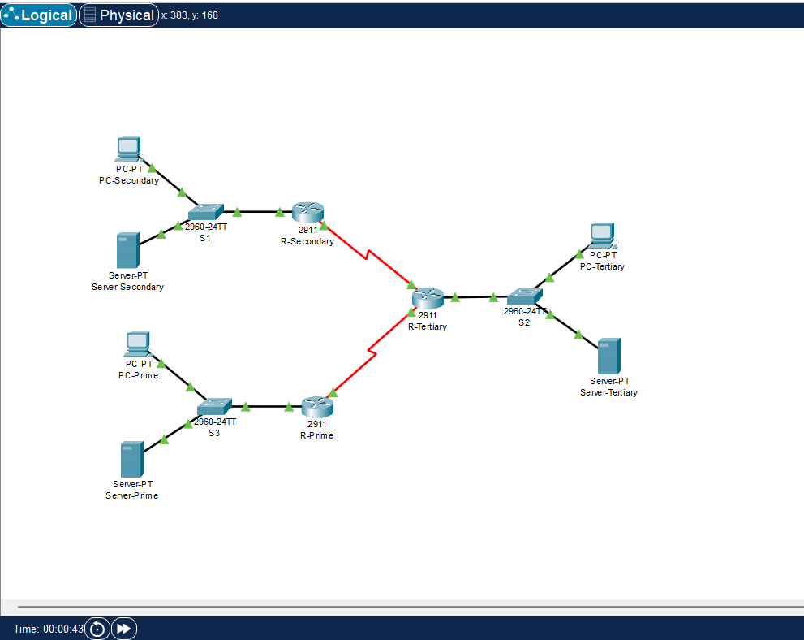

# 🌐 Network Configuration with NTP, SSH, and OSPF Authentication

This project focuses on configuring a secure and synchronized network using **Cisco Packet Tracer**.  
It demonstrates the use of **Network Time Protocol (NTP)**, **Secure Shell (SSH)**, and **OSPF Authentication** between routers to maintain secure and accurate communication.

---

## 🖼️ Project Overview

  

The network consists of several routers connected to a **Server-Prime**, which functions as the **NTP Server**.  
Each router:
- 🔒 Enables **SSH access** for secure remote login  
- 🕒 Synchronizes time using **NTP authentication**  
- 📡 Exchanges routing updates using **OSPF MD5 authentication**  

---

## ⚙️ Configuration Highlights
- Implemented **NTP authentication** to synchronize clocks across routers.  
- Enabled **SSH** for encrypted remote access.  
- Configured **OSPF** with **MD5 key authentication** for route protection.  

---

## 📂 Project Files

| Type | File | Description |
|------|------|--------------|
| 📘 **Report** | [View Report (PDF)](Network_Configuration_Report.pdf) | Contains detailed explanation of network setup & configuration steps |
| 💻 **Packet Tracer File** | [Open Network_Config.pkt](Network_Configuration.pkt) | Simulation file for Cisco Packet Tracer |
| 🧠 **Slides** | [View Presentation (PPTX)](Network_Configuration_Slides.pptx) | Project presentation slides |

---

## 🧰 Tools Used
- Cisco Packet Tracer 8.x  
- Cisco IOS CLI  
- Microsoft PowerPoint  
- Visual Studio Code  

---

## 👤 Author
**Mohd Azrul Redzuan**  
🎓 *Bachelor of Engineering Technology in Industrial Automation – UTeM*  
🔗 [GitHub Profile](https://github.com/muhdazrulredzuan)

---

⭐ *"A secure and synchronized network is the backbone of reliable communication."* ⚙️
