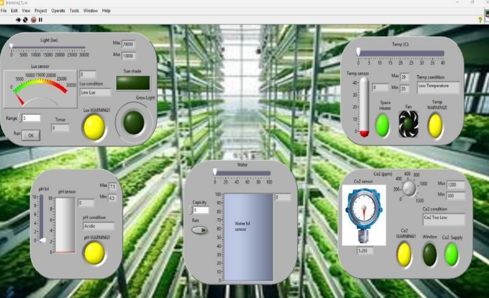

# 🌱 Smart Garden System

This project is a **LabVIEW-based Smart Garden** automation system designed to **monitor and control environmental conditions**.  
It demonstrates the use of sensors and actuators to automate watering, monitor soil moisture, and display real-time data.

---

## 🖼️ Project Overview

  

The system includes:  
- 💧 **Automatic watering** using soil moisture sensor and water pump  
- 🌡️ **Temperature and humidity monitoring** with fan control  
- 💡 **LED indicators** to show garden status  
- 📊 **Real-time data display** using LabVIEW interface  

---

## 📂 Project Files

| Type | File | Description |
|------|------|-------------|
| 📘 **Report** | [View Report (PDF)](Smart_Garden_Report.pdf) | Detailed explanation of system design, sensors, and automation logic |
| 💻 **LabVIEW File** | [Download SmartGarden.vi](Smart_Garden.vi) | LabVIEW project file to run the smart garden simulation |
| 📊 **Presentation Slides** | [View Slides (PPTX)](Smart_Garden_Slide.pptx) | PowerPoint presentation of the project |

---

## 🧰 Tools Used
- LabVIEW  
- DAQ Assistant / Sensors  
- Microsoft PowerPoint  
- Visual Studio Code (for documentation)  

---

## 👤 Author
**Mohd Azrul Redzuan**  
🎓 *Bachelor of Engineering Technology in Industrial Automation – UTeM*  
🔗 [GitHub Profile](https://github.com/muhdazrulredzuan)

---

⭐ *“Automating your garden makes technology grow alongside your plants.”* 🌿
