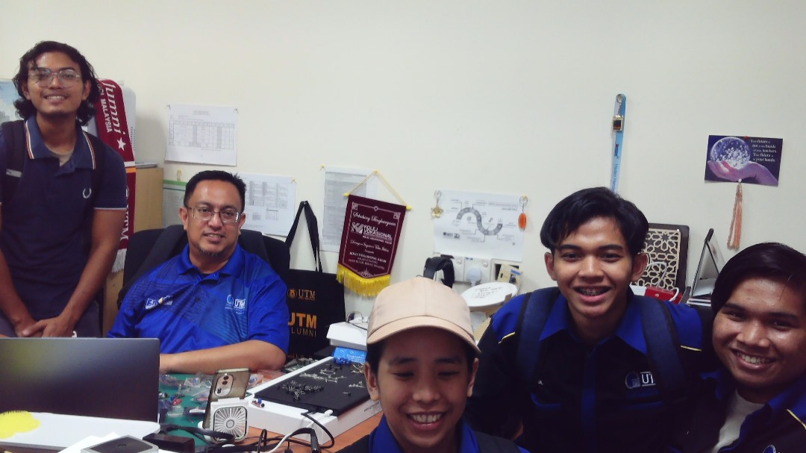

# 🏠 Smart Home Automation System

This project is a **Raspberry Pi Pico W-based Smart Home Automation System** designed to **control and monitor various home devices automatically**.  
It integrates sensors, actuators, and a mobile app interface to demonstrate IoT-style home automation.

---

## 🖼️ Photo With Supervisor

  

The system features:  
- 💧 Rain detection to operate servo motors  
- 🌡️ Humidity sensor with fan control at ≥30°C  
- 💡 Light & motion sensors controlling LED brightness  
- 🚦 IR sensor for occupancy detection and LED activation 

---

## 📂 Project Files

| Type | File | Description |
|------|------|-------------|
| 📘 **Report** | [View Report (PDF)](Smart_Home_Report.pdf) | Detailed documentation of sensors, logic, and Blynk integration |

---

## 🧰 Tools Used
- Raspberry Pi Pico W  
- Blynk IoT App  
- MicroPython / Thonny IDE  
- Various sensors & actuators (LDR, PIR, IR, servo, fan, LEDs)  

---

## 👤 Author
**Mohd Azrul Redzuan**  
🎓 *Bachelor of Engineering Technology in Industrial Automation – UTeM*  
🔗 [GitHub Profile](https://github.com/muhdazrulredzuan)

---

⭐ *“A smart home is where automation meets convenience and safety.”* 🏡
