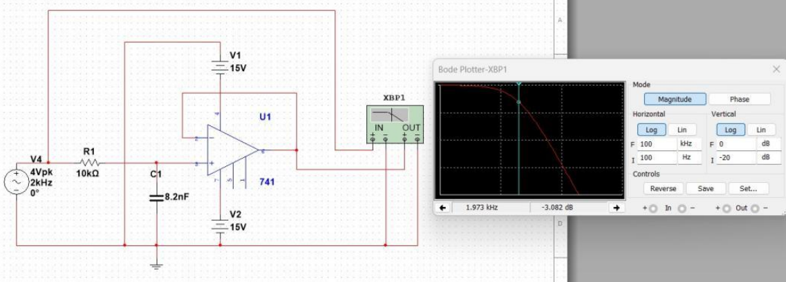

# 🎚️ Low Pass Frequency Filter (2 kHz)

This project focuses on designing and analyzing an **Active Low Pass Filter** with a **cutoff frequency of 2 kHz**.  
The circuit allows low-frequency signals to pass while attenuating high-frequency noise — an essential concept in audio and instrumentation systems. 🎵🔬  

---

## ⚙️ Project Overview  

- **Objective:** To design, simulate, and analyze an active low-pass filter using operational amplifiers (Op-Amps).  
- **Cutoff Frequency:** 2 kHz  
- **Main Component:** LM741 Op-Amp  
- **Simulation Tool:** Multisim  

**Features:**  
- Filters unwanted high-frequency signals.  
- Provides gain control using a feedback resistor.  
- Demonstrates frequency response and signal attenuation principles.  

---

## 🖼️ Circuit Diagram  

  

*Figure: Designed active low pass filter circuit (2 kHz cutoff frequency).*

---

## 📁 Project Files  

| File Type | Description | Link |
|------------|-------------|------|
| 🧾 Report | Detailed analysis, calculations, and simulation results | [View Report](Low_Pass_Filter_Report.pdf) |
| 📊 Simulation File | Multisim file for the active filter design | [View File](Low_Pass_Filter.ms14) |

---

## 📈 Frequency Response  

The designed filter achieves a **cutoff at approximately 2 kHz**, providing smooth signal attenuation beyond that point.  
This validates the **theoretical design** and matches the expected **Bode plot behavior**.

---

## 🏁 Conclusion  

This project successfully demonstrates the behavior of a **first-order active low pass filter**, essential for understanding signal conditioning, control systems, and analog circuit design. ⚡🎶  
