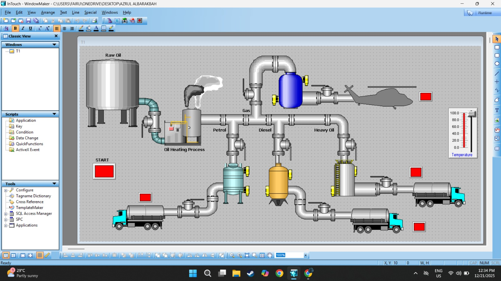

# 🛢️ Oil & Gas Process Monitoring – HMI Project (InTouch)

This project demonstrates an industrial **Human Machine Interface (HMI)** system for **oil & gas process monitoring**, developed using **InTouch (Wonderware)** software.  
The system visualizes process parameters and operational status in real time, similar to monitoring systems used in actual oil & gas plants.

---

## 🖼️ Project Images

<table>
  <tr>
    <th>Main HMI View</th>
  </tr>
  <tr>
    <td></td>
  </tr>
</table>

---

## 📄 Project Report
📘 [View Report (PDF)](BERL3125_Assignment1.pdf)

---

## 📽️ Project Video / Demonstration
🎬 [Watch Project Video](https://youtu.be/C0QXc4uTLkg?si=JdMayDAzlWECJ_1j)

---

## ⚙️ Project Description

The Oil & Gas HMI system allows users to:
- Monitor real-time process variables such as pressure, flow rate, and temperature  
- Visualize plant equipment status and alarms  
- Understand industrial process control and supervision through HMI interfaces  

This project simulates a basic monitoring system commonly used in **oil & gas production and processing plants**.

---

## 🧰 Tools & Software
- InTouch (Wonderware) HMI Software  
- Industrial process simulation tools  
- PC / Laptop for HMI visualization  

---

### 👤 Author
**Mohd Azrul Redzuan**  
🎓 Industrial Automation Technology – UTeM  
🔗 [GitHub Profile](https://github.com/muhdazrulredzuan)
