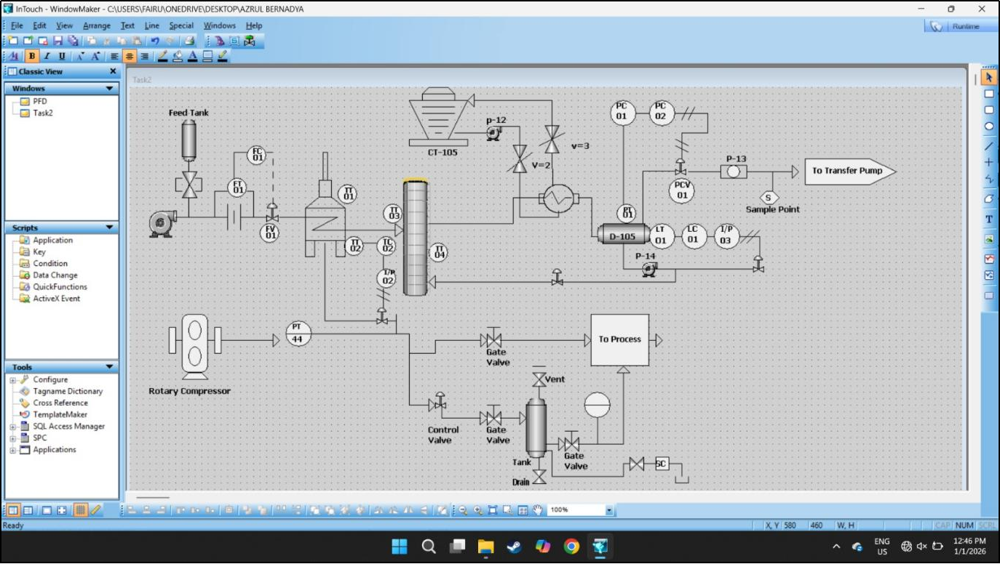

# 📐 PFD to P&ID Conversion – HMI Project (InTouch)

This project focuses on the conversion of **Process Flow Diagram (PFD)** into **Piping & Instrumentation Diagram (P&ID)** as part of an industrial HMI and process engineering study.  
The project helps in understanding process flow, instrumentation symbols, and detailed plant documentation used in the **oil & gas industry**.

---

## 🖼️ Project Image

<table>
  <tr>
    <th>P&ID Diagram View</th>
  </tr>
  <tr>
    <td></td>
  </tr>
</table>

---

## 📄 Project Report
📘 [View Report (PDF)](BERL3125_Assignment2.pdf)

---

### 👤 Author
**Mohd Azrul Redzuan**  
🎓 Industrial Automation Technology – UTeM  
🔗 [GitHub Profile](https://github.com/muhdazrulredzuan)
