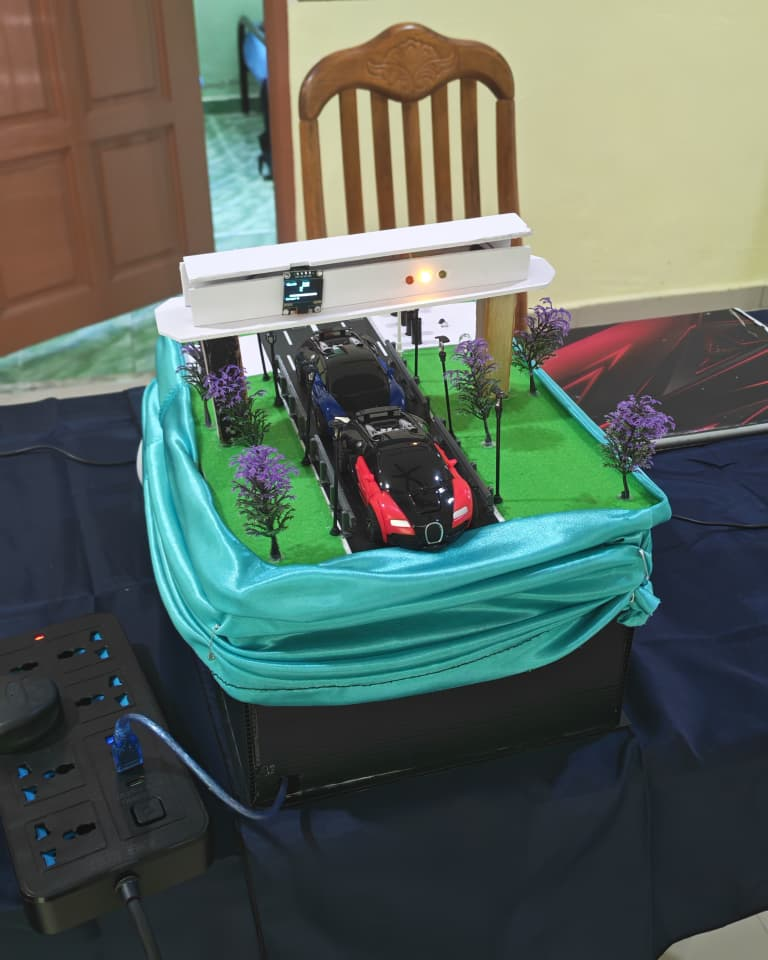
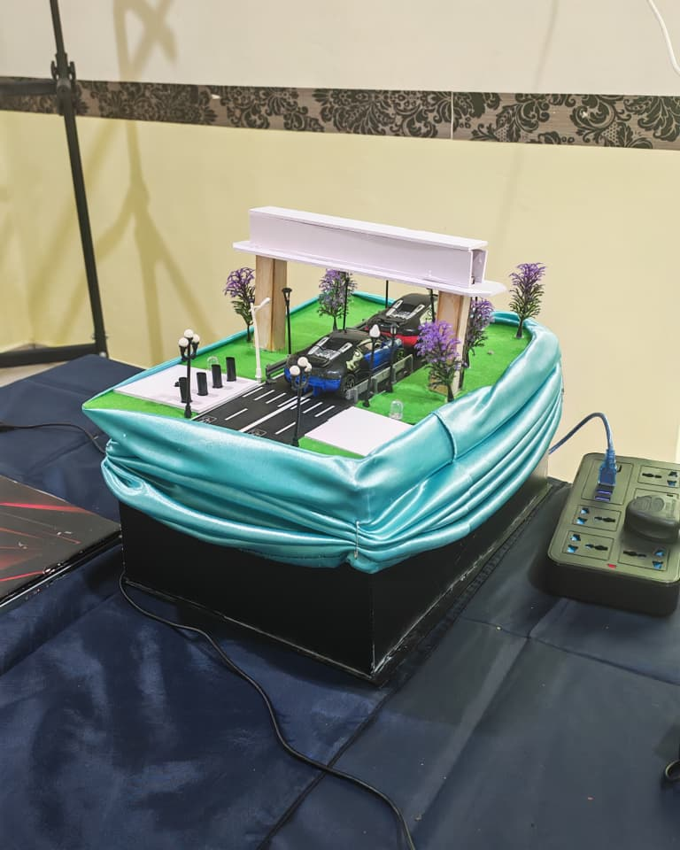
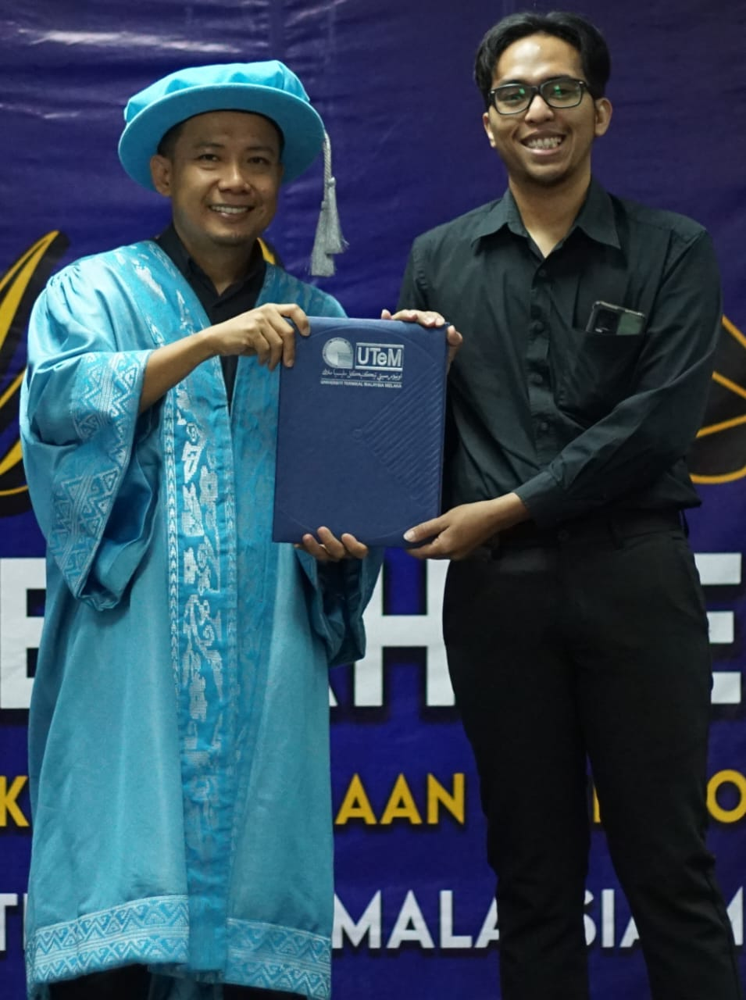
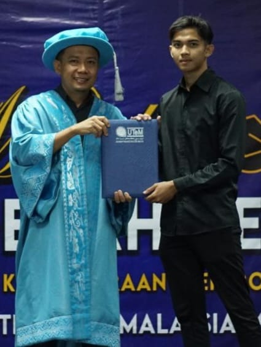
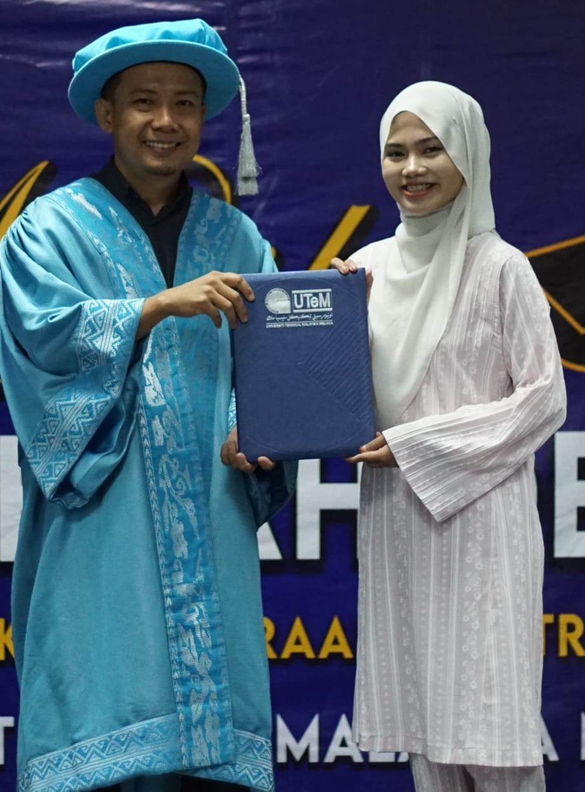
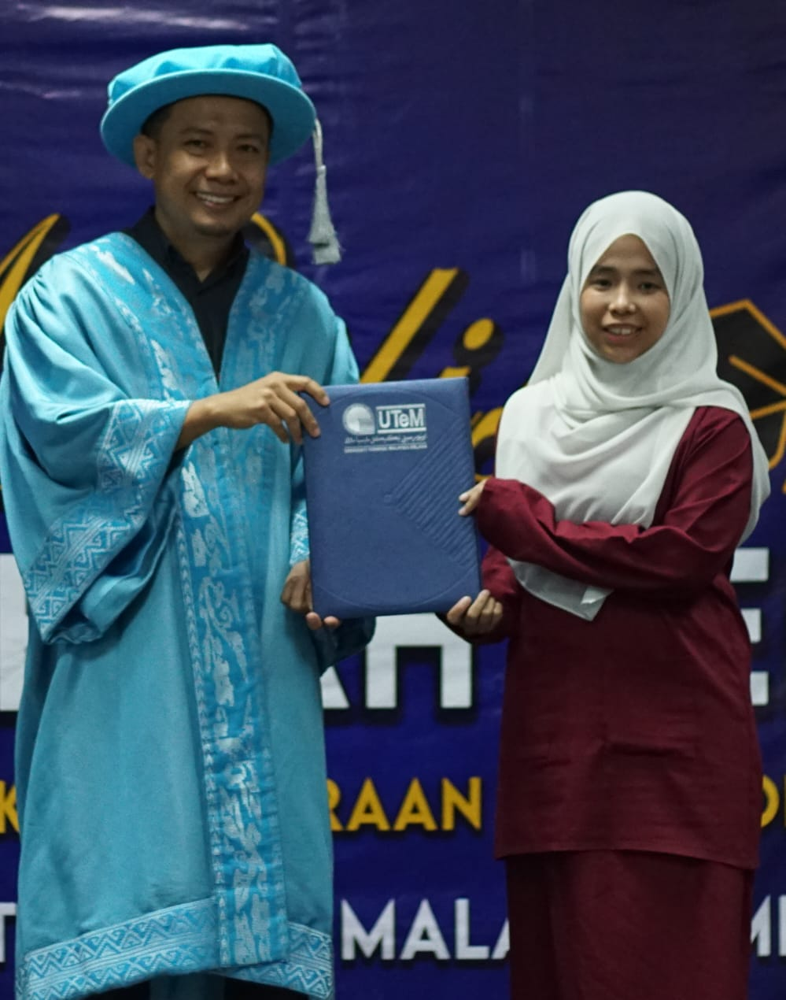

# 🚦 Smart Traffic Light System (IoT)

This project demonstrates the development of an **intelligent traffic light control system** integrated with IoT technology.  
The system monitors traffic conditions and manages traffic light signals in real time through a web-based dashboard.

It helps in understanding **IoT integration**, **real-time monitoring**, and **smart traffic management systems**.

---

## 🖼️ Project Images

### Front View

  

### Back View

  

---

## 📄 Project Report
📘 [View Report (PDF)](Smart Traffic Light.pdf)

---

## 📽️ Project Presentation
🎬 [View Presentation (PDF/Slides)](https://youtu.be/Y-ykNpIn4L4?si=uz3BsqIpdz1nq-As)

---

## 💻 Project Source Code
🔗 [View Code](Project/Project.ino)

---

## ⚙️ System Description

The Smart Traffic Light System allows:
- Real-time monitoring of traffic light states  
- Dynamic traffic signal management based on IoT sensor data  
- Remote control and visualization using **Node-RED** dashboard  

Sensors (simulated or real) detect traffic density and system adjusts traffic lights accordingly to optimize flow.

---

## 🧩 Basic System Flow
1. Traffic sensors detect vehicle presence  
2. Data is sent to the IoT platform (Node-RED)  
3. Traffic light sequence is adjusted dynamically  
4. Dashboard displays real-time traffic light status and system metrics  
5. Admin can monitor and control lights remotely if needed  

---

## 🔧 Technologies Used

| Technology | Purpose |
|------------|---------|
| Node-RED | IoT dashboard and workflow management |
| MQTT / HTTP | Communication between sensors and dashboard |
| Arduino / ESP32 | Traffic sensor data collection and control |
| HTML / CSS | Dashboard visualization |

---

## 🧰 Tools & Software
- Node-RED (IoT platform)  
- Arduino IDE / ESP32 development environment  
- Web browser for dashboard visualization  
- Simulation sensors or physical traffic sensors  

---

## 👥 Team Members

  
  
  
  

  <b>Azrul Redzuan</b> – Project Lead / IoT Integration &nbsp;&nbsp;|&nbsp;&nbsp;
  <b>Nurseri</b> – Hardware Setup / Sensor Interface &nbsp;&nbsp;|&nbsp;&nbsp;
  <b>Nur Faqihah</b> – Node-RED Dashboard Development &nbsp;&nbsp;|&nbsp;&nbsp;
  <b>Faisal Haqim</b> – Testing & Quality Assurance

---

## 🧠 Key Concepts
- **IoT-based monitoring and control systems**  
- **Real-time data acquisition and visualization**  
- **Traffic flow optimization using smart algorithms**  
- **Dashboard design for monitoring IoT systems**

---

## 🎓 Learning Outcomes
- Build and implement a **smart traffic light IoT system**  
- Understand **sensor integration with IoT dashboards**  
- Gain experience in **real-time monitoring and automation**  
- Learn **Node-RED workflow design and dashboard visualization**

---

### 👤 Author
**Mohd Azrul Redzuan**  
🎓 Industrial Automation Technology – UTeM  
🔗 [GitHub Profile](https://github.com/muhdazrulredzuan)
